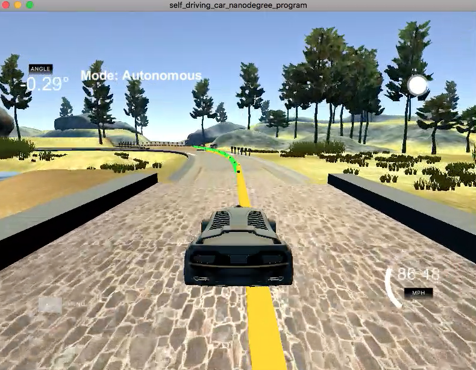

# Model Predictive Control (MPC) Project
Self-Driving Car Engineer Nanodegree Program


## Kerem Par
<kerempar@gmail.com>

---

## Introduction

In this project, a Model Predictive Control was implemented in C++ to drive the car around the track. The cross track error is not given by the simulator, it is calculated within the controller. Additionally, there's a 100 millisecond latency between actuations commands on top of the connection latency.

## Compilation

Code compiles without errors with cmake and make. 
The following change has been made to the original CMakeLists.txt. The line link_directories(/usr/local/Cellar/libuv/1.11.0/lib) was replaced by link_directories(/usr/local/Cellar/libuv/1.15.0/lib) because of the version of libuv installed.

## Implementation

The base algorithm follows MPC procedure that was taught in the lessons.

###The Model

The model consists of 6 state variables 

| State variable | Description|
| ----- | ------- | 
|  *x*    |  x position  |  
|  *y*   |  y position  | 
|  *ψ (psi)*   |  orientation  | 
|  *v*   |  velocity  | 
|  *cte*   |  cross track error  | 
|  *eψ (epsi)*   |  orientation error  | 

and 2 actuators 

| Actuator  |  Description|
| ----- | ------- | 
|  *δ (delta)*    |  steering angle  |  
|  *a*   |  throttle  | 

Following  equations were used for the next state to implement the Global Kinematic Model.

\\[
 x_{t+1} = x_t  + v_t * cos(ψ_t) * dt
\\]

\\[
 y_{t+1} = y_t  + v_t * sin(ψ_t) * dt 
\\]
	 	 
\\[
 ψ_{t+1} = ψ_t  + v_t/L_f * δ_t * dt 
\\]

\\[
 v_{t+1} = v_t  + v_t * a_t * dt 
\\]

\\[
 cte_{t+1} = f(x_t) - y_t  + (v_t * sin(ψ_t) * dt) 
\\]

\\[
 eψ_{t+1} = ψ_t  -ψdes_t + (v_t/L_f * δ_t * dt) 
\\]


If δ is positive we rotate counter-clockwise, or turn left. In the simulator however, a positive value implies a right turn and a negative value implies a left turn. To get around this the update equation for ψ was changed to

\\[
 ψ_{t+1} = ψ_t  - v_t/L_f * δ_t * dt 
\\]

The following additional coefficients were used in the cost function in `operator` method in MPC implementation, The values were found manually by trial and error to achieve a stable ride.

| Cost component |  Coefficient|
| ----- | ------- | 
|  *cross track error (cte)*    |  2500  |  
|  *orientation error (eψ)*   |  2500  | 
|  *streering angle*   |  200  | 
|  *acceleration*   |  5  | 
|  *change in sequential streering inputs*   |  1000  | 


###Timestep Length and Elapsed Duration (N & dt) 

Timestep length (N) and elapsed duration between timesteps (dt) were chosen as `10` and `0.1`, respectively, corresponding to a `1,5` seconds horizon.  Initially, more timesteps (25, 20, 15) were tried. They sometimes caused unstable behavior. However, it was observed that for each iteration, the server sends 6 waypoints and 10 timesteps is a better match for the number of waypoints and resulted a more stable ride. 


###Polynomial Fitting and MPC Preprocessing

Since the server returns waypoints using the map's coordinate system, which is different than the car's coordinate system. Waypoint coordinates were first transformed to the car's coordinate system. These waypoints made it easier to both display them and to calculate the CTE and Epsi values for the model predictive controller.

Since the reference trajectory is typically passed to the control block as a polynomial and third order polynomials fit trajectories for most roads, a 3rd order polynomial was fitted to the waypoints.

`polyfit` was used to fit a 3rd order polynomial to the given x and y coordinates representing waypoints.

`polyeval` was used to evaluate y values of given x coordinates.

The vehicle was assumed to be in position (0, 0).

###Model Predictive Control with Latency

Model Predictive Control has been implemeted to handle a 100 millisecond latency. 
In order to deal with latency, the state values coming from the server were updated with the predicted values for 100 millisecond before being sent to the MPC block by using the following equations. In other words, a simulation has been run using the vehicle model starting from the current state for the duration of the latency. The resulting state from the simulation was the new initial state for MPC.

\\[
 x_{t+1} = x_t  + v_t * cos(ψ_t) * dt
\\]

\\[
 y_{t+1} = y_t  + v_t * sin(ψ_t) * dt 
\\]
	 	 
\\[
 ψ_{t+1} = ψ_t  - v_t/L_f * δ_t * dt 
\\]

\\[
 v_{t+1} = v_t  + v_t * a_t * dt 
\\]

\\[
 cte_{t+1} = cte_t  + v_t * sin(ψ_t) * dt 
\\]

\\[
 eψ_{t+1} = eψ_t  - v_t/L_f * δ_t * dt 
\\]

## Simulation

After tuning the parameters by several iterations. The vehicle was tested in the simulator (The reference velcity was set to `90 mph`). The vehicle successfully drove a lap around the track.

No tire left the drivable portion of the track surface. The car did not pop up onto ledges or roll over any surfaces that would otherwise be considered unsafe (if humans were in the vehicle).

The car did not go over the curb, but, sometimes drove on the lines before the curbs.

Both the reference path and the MPC trajectory path have been visualized in the simulator by sending a list of x and y values to the `mpc_x`, `mpc_y`, `next_x`, and `next_y` fields in the C++ main script.

The `mpc_x` and `mpc_y` variables display a line projection in green. The `next_x` and `next_y` variables display a line projection in yellow. You can display these both at the same time, as seen in the image above.

A complete lap of the vehicle can seen in the following video with this configuration.

[](./video/MPC_Video.mov)


The yellow is a polynomial fitted to waypoints and the green line represents the x and y coordinates of the MPC trajectory.

## Dependencies

* cmake >= 3.5
 * All OSes: [click here for installation instructions](https://cmake.org/install/)
* make >= 4.1(mac, linux), 3.81(Windows)
  * Linux: make is installed by default on most Linux distros
  * Mac: [install Xcode command line tools to get make](https://developer.apple.com/xcode/features/)
  * Windows: [Click here for installation instructions](http://gnuwin32.sourceforge.net/packages/make.htm)
* gcc/g++ >= 5.4
  * Linux: gcc / g++ is installed by default on most Linux distros
  * Mac: same deal as make - [install Xcode command line tools]((https://developer.apple.com/xcode/features/)
  * Windows: recommend using [MinGW](http://www.mingw.org/)
* [uWebSockets](https://github.com/uWebSockets/uWebSockets)
  * Run either `install-mac.sh` or `install-ubuntu.sh`.
  * If you install from source, checkout to commit `e94b6e1`, i.e.
    ```
    git clone https://github.com/uWebSockets/uWebSockets
    cd uWebSockets
    git checkout e94b6e1
    ```
    Some function signatures have changed in v0.14.x. See [this PR](https://github.com/udacity/CarND-MPC-Project/pull/3) for more details.

* **Ipopt and CppAD:** Please refer to [this document](https://github.com/udacity/CarND-MPC-Project/blob/master/install_Ipopt_CppAD.md) for installation instructions.
* [Eigen](http://eigen.tuxfamily.org/index.php?title=Main_Page). This is already part of the repo so you shouldn't have to worry about it.
* Simulator. You can download these from the [releases tab](https://github.com/udacity/self-driving-car-sim/releases).
* Not a dependency but read the [DATA.md](./DATA.md) for a description of the data sent back from the simulator.

## Basic Build Instructions

1. Clone this repo.
2. Make a build directory: `mkdir build && cd build`
3. Compile: `cmake .. && make`
4. Run it: `./mpc`. 


